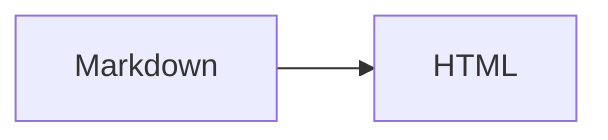

이 블로그에서 쓸 수 있는 Markdown 문법을 모았습니다. 각 문법을 어떻게 쓰는지는 이 글의 원본 `src/content/posts/markdown-example.md`를 같이 열어 보면 됩니다.

## Table of contents

## 제목

`#` 개수로 제목 단계를 정합니다. 글 제목이 `h1`이므로 본문은 `##`부터 씁니다. 제목에 마우스를 올리면 `#` 링크가 나타납니다.

### 제목 3

#### 제목 4

## 텍스트 꾸미기

- **굵게**, _기울임_, _**굵은 기울임**_, ~~취소선~~
- `인라인 코드`
- <mark>형광펜</mark>, <kbd>Ctrl</kbd> + <kbd>C</kbd>, H<sub>2</sub>O, x<sup>2</sup>

문단 안에서 줄을 바꾸려면 줄 끝에 역슬래시를 붙입니다.\
이 줄은 같은 문단의 다음 줄입니다.

## 링크

- 외부 링크: [Astro 문서](https://docs.astro.build)
- 다른 글: [Mermaid 다이어그램 예시](/posts/mermaid-example/)
- 같은 글의 제목: [표로 이동](#표)
- 자동 링크: https://astro.build

## 목록

- 순서 없는 목록
- 두 번째 항목
  - 들여쓰면 하위 목록
    - 더 깊은 하위 목록

1. 순서 있는 목록
2. 두 번째 항목
   1. 하위 번호 목록

- [x] 완료한 할 일
- [ ] 남은 할 일

## 인용문

> 일반 인용문입니다.
>
> > 인용문 안에 인용문을 넣을 수도 있습니다.

## Callout

인용문 첫 줄에 `[!종류]`를 쓰면 Callout이 됩니다.

```md
> [!NOTE]
> 기본 제목은 종류 이름입니다.

> [!TIP] 제목을 직접 지정
> 종류 뒤에 제목을 쓰면 됩니다.

> [!WARNING]- 접힌 상태로 시작
> `-`를 붙이면 접히고, `+`를 붙이면 펼친 상태로 접을 수 있습니다.
```

### 종류

> [!NOTE]
> 메모. `note`

> [!ABSTRACT]
> 요약. `abstract`, `summary`, `tldr`

> [!INFO]
> 정보. `info`

> [!TODO]
> 할 일. `todo`

> [!TIP]
> 팁. `tip`, `hint`, `important`

> [!SUCCESS]
> 성공. `success`, `check`, `done`

> [!QUESTION]
> 질문. `question`, `help`, `faq`

> [!WARNING]
> 경고. `warning`, `caution`, `attention`

> [!FAILURE]
> 실패. `failure`, `fail`, `missing`

> [!DANGER]
> 위험. `danger`, `error`

> [!BUG]
> 버그. `bug`

> [!EXAMPLE]
> 예시. `example`

> [!QUOTE]
> 인용. `quote`, `cite`

종류 이름은 대소문자를 가리지 않습니다. GitHub에서 쓰는 `[!IMPORTANT]`, `[!CAUTION]`도 각각 팁, 경고 모양으로 나옵니다.

### 제목 지정과 접기

> [!TIP] 직접 지정한 제목
> 종류 뒤에 쓴 글이 제목이 됩니다.

> [!INFO]- 클릭해서 펼치기
> 처음에는 접혀 있는 Callout입니다.

> [!SUCCESS]+ 클릭해서 접기
> 처음에는 펼쳐져 있고, 제목을 누르면 접힙니다.

> [!NOTE] 중첩
> Callout 안에 다른 Callout을 넣을 수 있습니다.
>
> > [!WARNING]
> > 안쪽 Callout입니다.

## 코드

문장 안에서는 `const a = 1`처럼 백틱 하나로 감쌉니다. 블록은 백틱 세 개와 언어 이름으로 시작합니다.

```ts
function greet(name: string): string {
  return `Hello, ${name}!`;
}
```

### 파일 이름 표시

언어 이름 뒤에 `file="파일명"`을 붙입니다.

```ts file="src/utils/greet.ts"
export const greet = (name: string) => `Hello, ${name}!`;
```

### 줄 강조, 추가·삭제, 단어 강조

코드 줄 끝 주석으로 표시합니다.

- `// [!code highlight]`: 그 줄 강조
- `// [!code ++]`, `// [!code --]`: 추가한 줄, 삭제한 줄
- `// [!code word:단어]`: 다음 줄부터 해당 단어 강조

```ts
const config = {
  title: "AstroPaper", // [!code --]
  title: "내 블로그", // [!code ++]
  lang: "ko", // [!code highlight]
};
```

```ts
// [!code word:greet]
const message = greet("world");
console.log(greet("astro"));
```

긴 줄은 가로로 스크롤됩니다.

```bash
pnpm add remark-math rehype-katex katex mermaid && pnpm run build && pnpm run preview --host 0.0.0.0 --port 4321
```

## 표

`:`로 정렬을 지정합니다.

| 왼쪽 정렬 | 가운데 정렬 | 오른쪽 정렬 |
| :-------- | :---------: | ----------: |
| 사과      |    빨강     |       1,000 |
| 바나나    |    노랑     |      12,500 |
| 포도      |    보라     |     130,000 |

## 이미지

이미지를 누르면 크게 볼 수 있습니다.


`public/`에 넣은 이미지는 `/파일명`으로, `src/assets/images/`에 넣은 이미지는 `@/assets/images/파일명`으로 씁니다. `src/assets`에 넣으면 빌드할 때 이미지가 최적화됩니다.

## 접기

HTML `<details>` 태그로 내용을 접을 수 있습니다.

<details>
<summary>클릭해서 펼치기</summary>

접혀 있던 내용입니다. 안에서도 **Markdown**을 쓸 수 있습니다. 위아래에 빈 줄을 두어야 합니다.

</details>

## 각주

문장 끝에 각주를 달 수 있습니다.[^1] 각주 내용은 글 맨 아래에 모입니다.[^note]

[^1]: 첫 번째 각주입니다.

[^note]: 각주 이름은 숫자가 아니어도 됩니다.

## 구분선

`---`를 한 줄에 쓰면 구분선이 됩니다.

---

## 수식과 다이어그램

수식은 $a^2 + b^2 = c^2$처럼 달러 기호로 감쌉니다. 자세한 내용은 [LaTeX 수식 예시](/posts/latex-example/)를 보세요.



다이어그램은 [Mermaid 다이어그램 예시](/posts/mermaid-example/)에 더 있습니다.

## 특수문자 그대로 쓰기

Markdown 기호 앞에 역슬래시를 붙이면 문법으로 처리되지 않습니다: \*별표\*, \# 샵, \[대괄호\], \$ 달러.
