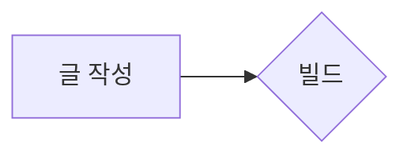
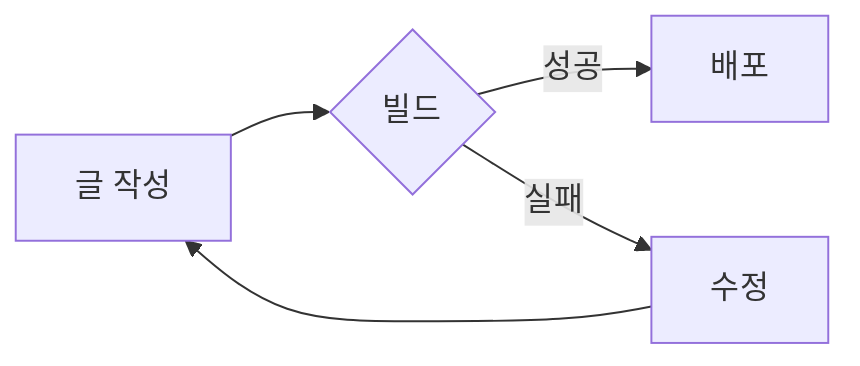
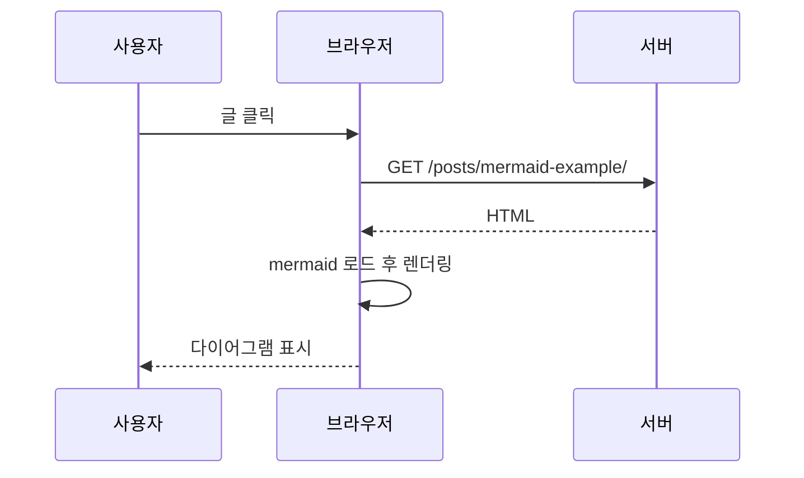
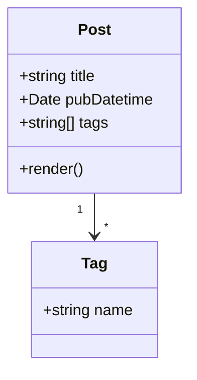
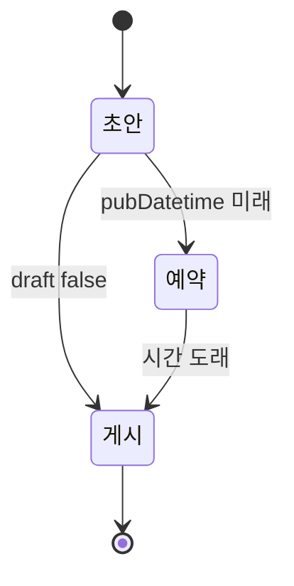
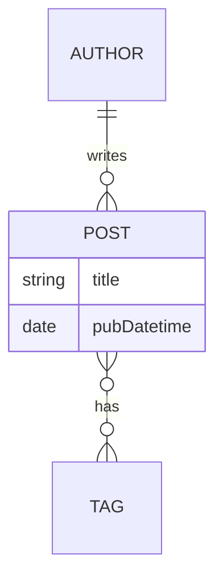
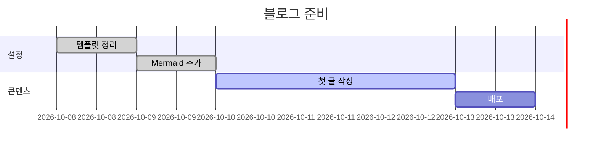
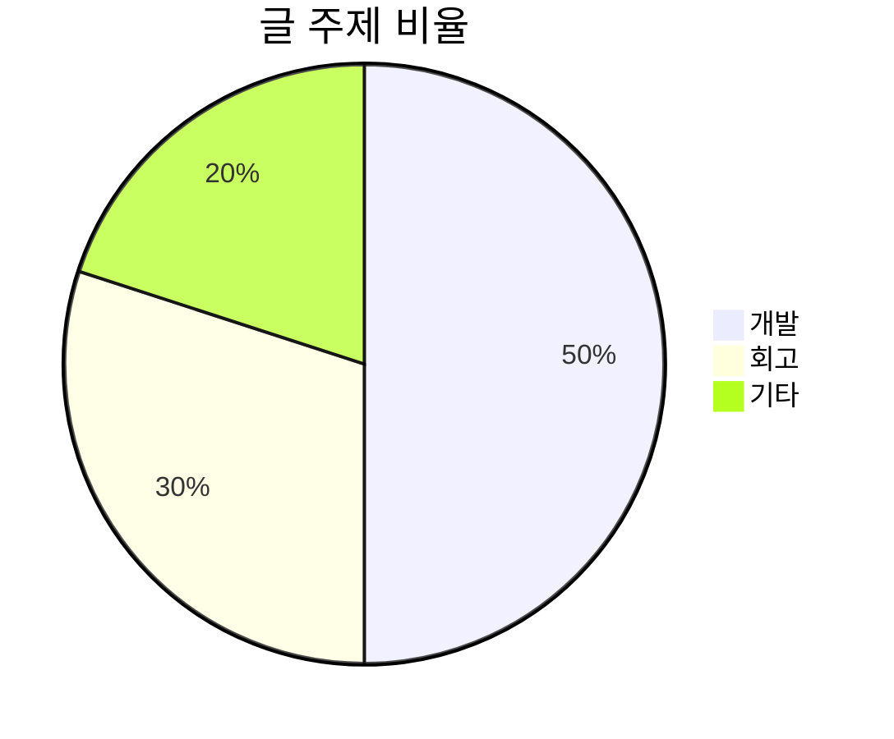
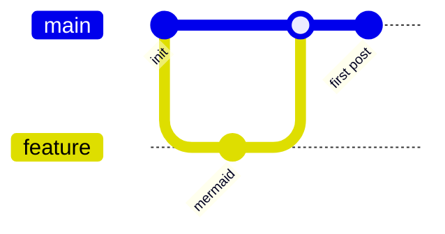

코드블록 언어를 `mermaid`로 지정하면 다이어그램으로 그려집니다. 테마를 바꾸면 다이어그램 색도 같이 바뀝니다.

````md

````

## 순서도 (flowchart)



## 시퀀스 다이어그램 (sequence)



## 클래스 다이어그램 (class)



## 상태 다이어그램 (state)



## ER 다이어그램 (entity relationship)



## 간트 차트 (gantt)



## 파이 차트 (pie)



## Git 그래프 (gitGraph)



## 문법 오류일 때

다이어그램 문법이 틀리면 빈칸 대신 원문이 그대로 보입니다.

```mermaid
flowchart LR
  A -->
```
